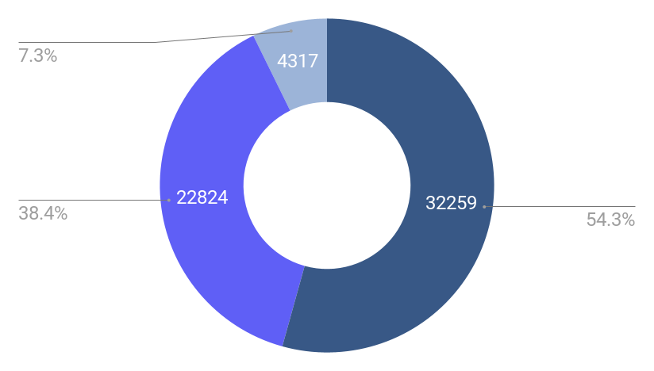

# Overview
Tanzania is a country where 16 million people lack access to safe water. This is 27% of the population. We want to create a predictive model that can predict water well functionality based on several [input features](./features.txt). We especially want to be able to predict when a well isn't functional, so we can repair it accordingly. In this notebook, we attempt to find the best combination of hyperparamters that produces the most accurate predictions.

We would like to recommend a predictive model to [The US Agency of international development](https://www.usaid.gov/) so that they can identify non-functional wells in Tanzania, and then take the proper repair actions to prevent human deaths.

# Objective:
Given various features of water wells in Tanzania, predict each well's condition/functionality. The possible values for well functionality are as follows:
  - Functional (class 0)
  - Functional, Needs repairs (class 1)
  - Non-functional (class 2)

The end goal was to build a predictive model that properly identifies each of these 3 classes with maximum accuracy. Identifying classes 1 and 2 (dysfunctional wells) was a higher priority, as the consequences for misidentifying these wells could be human lives.

# Data
The [data](https://www.drivendata.org/competitions/7/pump-it-up-data-mining-the-water-table/data/) consisted of close to 60,000 water wells in Tanzania, recorded by GeoData Consultants Ltd. The data contained the well's type, water source, geographical info, as well as payment information and the organizations or governmental bodies involved. Here is a chart of the class distribution:

# Data Cleaning
The dataset originally held 39 columns that described unique information for each well: geographic features, water source, pump type, as well as organizations involved and other water well features. More in-depth explanations of these columns can be found in [this file](./features.txt).
Only 7 of the columns contained missing values. These values were filled with various values, including the mean and median for numeric columns and the most frequent value for categorical columns. I achieved this by using [sklearn's](https://scikit-learn.org/stable/modules/classes.html) SimpleImputer and MissingIndicator in the [pipeline notebook](./model_pipeline.ipynb).

The age of a water well seemed like a very intuitive feature, so i calculated this using the "recorded date" and the "construction year". For missing values in the construction year column, I filled these rows with the year '1986' (the median).

The "funder" and "installer" columns contained roughly 2000 unique values each. This many categories can cost time and resources in the model training process. To solve this, I took only funders and installers with 100+ occurances in the dataset, as they made up the vast majority of total funders and installers. I replaced the remaining rows with the value "other".

Some of the latitude and longitude values were invalid (outside of Tanzania). I set these values to "null" so that they could be imputed and indicated in the [model pipeline](./model_pipeline.ipynb).

I then scoured through this data and removed unimportant or redundant columns.

In total, 15 features were removed, and water well age was added. This resulted in 25 features to train our models on. The complete data cleaning process can be found in the [data cleaning notebook](./cleaning.ipynb).

# Modeling
Aside from the dummy model, all models in this repo were built using [sklearn.LogisticRegression](https://scikit-learn.org/stable/modules/generated/sklearn.linear_model.LogisticRegression.html).

> All accuracies referenced in this section are drawn from the testing data - data that our model has yet to see.

> "__Dysfunctional__" accuracy refers to the combined prediction accuracy for "non-functional" and "needs repair" wells.

### Simple Models
The modeling process began by building 3 [simple models](./simple_models.ipynb) with no hyperparameter tuning:

1. The baseline model (sklearn.DummyClassifier):
    - The baseline model simply predicted the most common class (functional), and predicted with 54.2% accuracy.
2. A base logistic regression:
    - This model used default parameters and predicted with 77.7% accuracy.
    - It struggled to classify the "needs repair" wells, as they only maded up 7% of our dataset. Below, I incorporate synthetic minority oversampling ([SMOTE](https://imbalanced-learn.org/stable/references/generated/imblearn.over_sampling.SMOTE.html)) to address this.
3. Base logistic regression with SMOTE:
    - The predictions for class 1 were indeed more accurate. However, the accuracies of both class 0 and class 2 declined. The overall prediction accuracy decreased to 64%.

The base logistic regression was now the benchmark with 77.7% overall accuracy and x% dysfunctional accuracy. Future models were designed to beat these numbers.

### Final models
Final models were found by conducting iterative grid searches, and taking the most consistent hyperparameters from each search. I strived to find models that had both an impressive overall accuracy, as well as a remarkable propensity to identify dysfunctional wells.

__The TriWell Predictor__
The TWP took the same ternary classification approach as the simple models, but this time with optimized parameters:
- 77.7% overall accuracy
- 64.7% dysfunctional accuracy

__The AquaClassify Pro__
The AC Pro turned the classification problem into a binary one, combining the two "dysfunctional" well categories as class 1:
- 79.4% overall accuracy
- 71.3% dysfunctional accuracy

Overall the final recommendation was the __The AquaClassify Pro__, as it demonstrated great accuracy to properly identify wells at large, as well as an impressive dyfunctional accuracy.

# Repo ToC:

- [Data cleaning notebook](./cleaning.ipynb)
- [Simple models](./simple_models.ipynb)
- [Final models notebook](./model_pipeline.ipynb)
- [Description of features](./features.txt)
